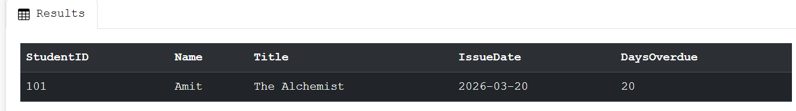
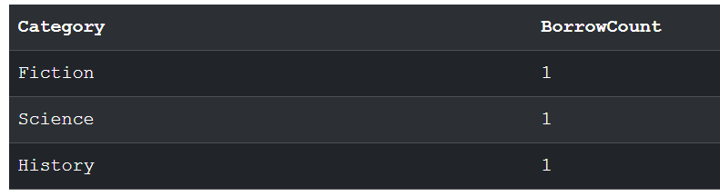
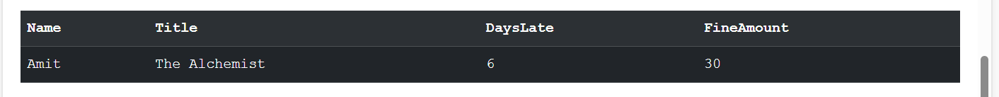
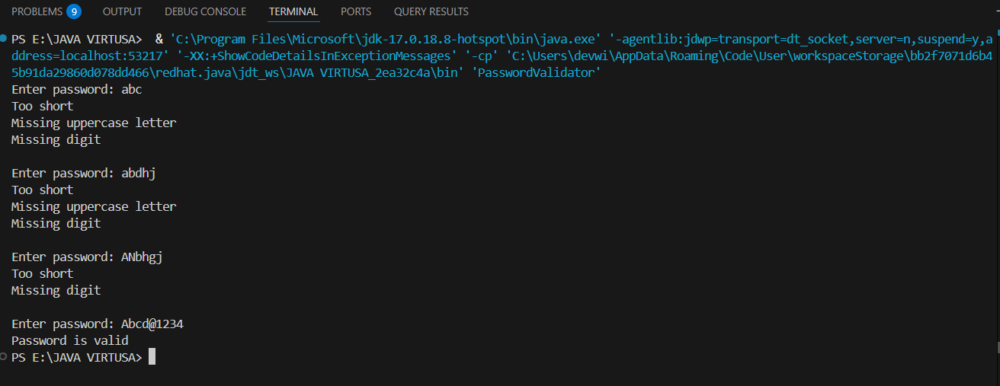

# Virtusa Use Case Projects

**Name:** Siddharth V - SRMIST, Chennai
**Contact:** Siddx.1184@gmail.com

## 📂 Project Structure
Virtusa-UseCase-Projects/
│
├── Python/
│ ├── Farecalc.py
│ └── Python use case.png
│
├── SQL/
│ ├── Digitallib.sql
│ ├── RES1.png
│ ├── RES2.png
│ └── RES3.png
│
├── Java/
│ ├── SafeLog.java
│ └── Result.png
│
└── README.md

---

## 1. Python — FareCalc Travel Optimizer

A backend fare calculation script for a fictional ride-sharing startup, CityCab.

**Features**
- Calculates fares based on distance and vehicle type (Economy, Premium, SUV)
- Applies a 1.5x surge multiplier during peak hours (17:00 – 20:00)
- Handles invalid vehicle input with a clear error message
- Prints a formatted price receipt to the terminal

**How to Run**
1. Open a terminal and navigate to the project folder
2. Run `python Farecalc.py`
3. Enter distance, hour of travel, and vehicle type when prompted

**Output**

---

## 2. SQL — Digital Library Audit

A relational database system for managing a digital library — tracking books, students, and borrowing activity.

**Tables**
- `Books` — Book details (title, author, category)
- `Students` — Student information
- `IssuedBooks` — Borrowing records with issue and return dates

**Features**
- Identifies overdue books (not returned within 14 days)
- Finds the most borrowed book categories
- Removes inactive student records (no activity for 3+ years)
- Calculates fines at ₹5 per day after the 14-day limit

**How to Run**
1. Open SQL Server Management Studio (SSMS)
2. Create a new query and paste the script from `Digitallib.sql`
3. Run the script and view results in the output grid

**Output**

## 3. Java — SafeLog Password Validator

A simple console-based application designed to enforce strong password creation based on predefined security rules.

**Features**
- Validates password length (minimum 8 characters)
- Ensures at least one uppercase letter is present
- Ensures at least one numeric digit is included
- Provides clear feedback for each failed condition
- Continuously prompts the user until a valid password is entered

**Concepts Used**
- Loops (`while`, `for`)
- Conditional statements (`if-else`)
- String manipulation
- Built-in `Character` methods (`isUpperCase`, `isDigit`)
- User input handling using `Scanner`

**How to Run**
1. Open a terminal in the `Java` folder  
2. Compile the file
3. Run the program
4. Enter passwords until it gets accepted.

